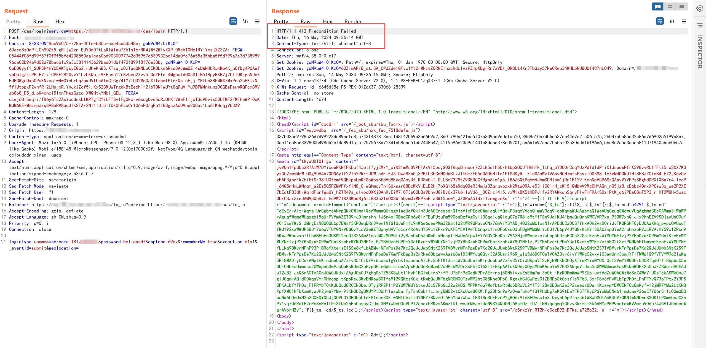
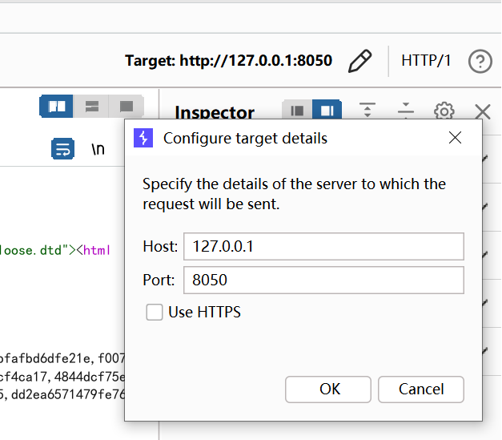
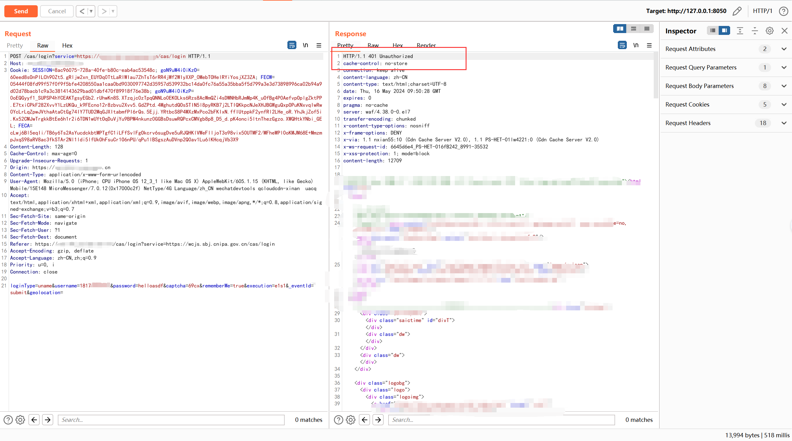
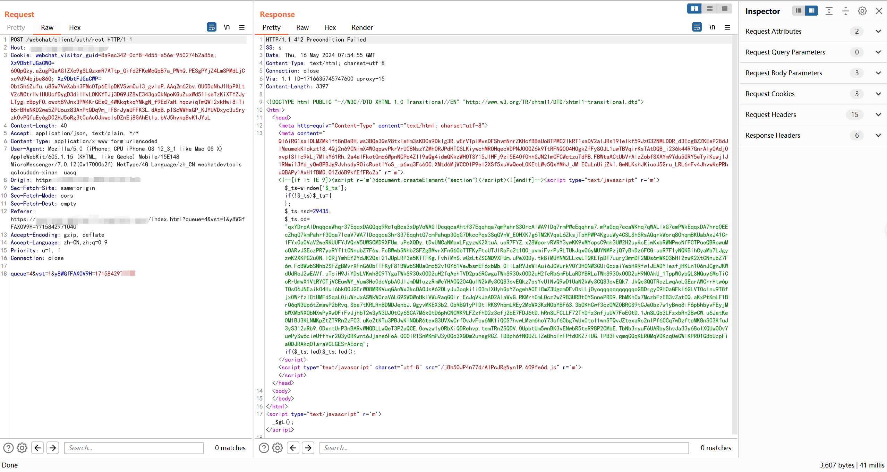
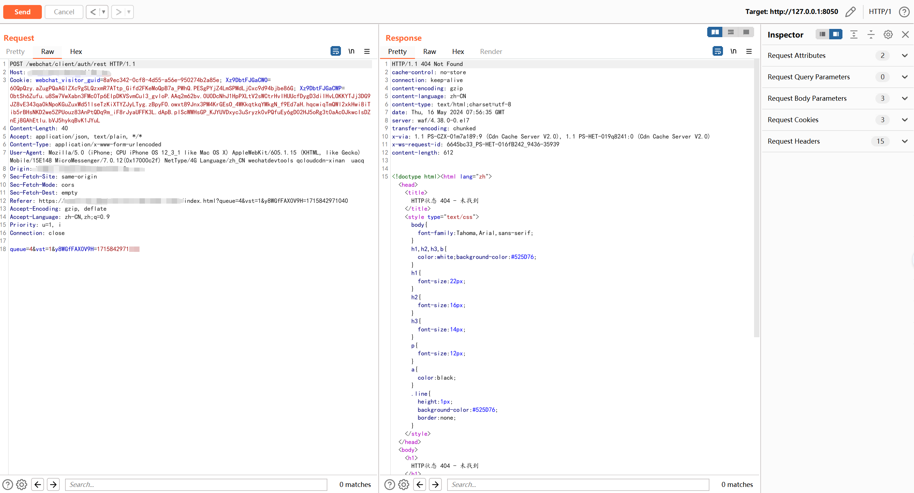

# 瑞数-全版本 bypass
# 免责声明
1、项目内所涉及任何脚本、LOGO 、工作流仅为资源共享、学习参考之目的，不保证其合法性、正当性、准确性；请根据情况自行判断，切勿使用项目做任何商业用途或牟利；

2、遵循避风港原则，若有图片和内容等侵权，请在 Issues 告知，核实后删除，其版权均归原作者及其网站所有；

3、本人不对任何内容承担任何责任，包括但不限于任何内容错误导致的任何损失、损害;
其它人通过任何方式登陆本网站或直接、间接使用项目相关资源，均应仔细阅读本声明，一旦使用、转载项目任何相关教程或资源，即被视为您已接受此免责声明。

4、本项目内所有资源文件，禁止任何公众号、自媒体进行任何形式的转载、发布。

5、本项目涉及的数据由使用的个人或组织自行填写，本项目不对数据内容负责，包括但不限于数据的真实性、准确性、合法性。使用本项目所造成的一切后果，与本项目的所有贡献者无关，由使用的个人或组织完全承担。

6、本项目中涉及的第三方硬件、软件等，与本项目没有任何直接或间接的关系。本项目仅对部署和使用过程进行客观描述，不代表支持使用任何第三方硬件、软件。使用任何第三方硬件、软件，所造成的一切后果由使用的个人或组织承担，与本项目无关。

7、本项目中所有内容只供学习和研究使用，不得将本项目中任何内容用于违法行为，包括但不限于建立 VPS 或违反国家/地区/组织等的法律法规或相关规定的其他用途。作者对于由此引起的任何隐私泄漏或其他后果概不负责.

8、所有基于本项目源代码，进行的任何修改，为其他个人或组织的自发行为，与本项目没有任何直接或间接的关系，所造成的一切后果亦与本项目无关。

9、所有直接或间接使用本项目的个人和组织，应24小时内完成学习和研究，并及时删除本项目中的所有内容。如对本项目的功能有需求，应自行开发相关功能。

10、本项目保留随时对免责声明进行补充或更改的权利，直接或间接使用本项目内容的个人或组织，视为接受本项目的特别声明。


# 测试环境
os: windows10

chrome: 124.0.6367.202

python: python3.8

DrissionPage: 4.0.4.22


# 原理

端口转发，本地监听8050端口。使用burp、curl或者任意工具，访问本地8050端口，所有的数据都会经过转发，转发到目标服务器，并将数据返回


# 使用方法

安装依赖

```
pip install -r requirements.txt
```

设置目标地址，运行，默认监听本地 8050端口


```
python RuiShuBypass.py
```


有瑞数设备返回 412




修改target，修改为本地 8050端口




完美绕过







